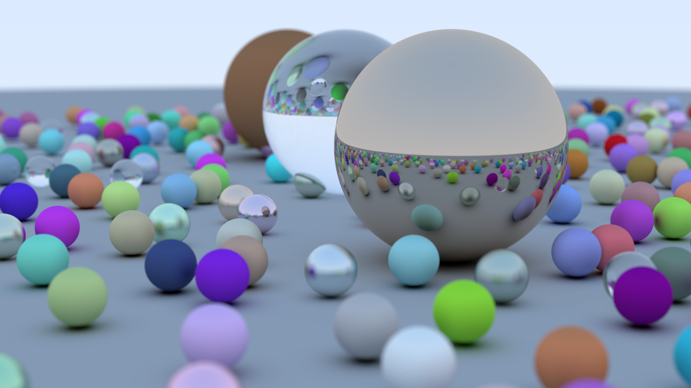
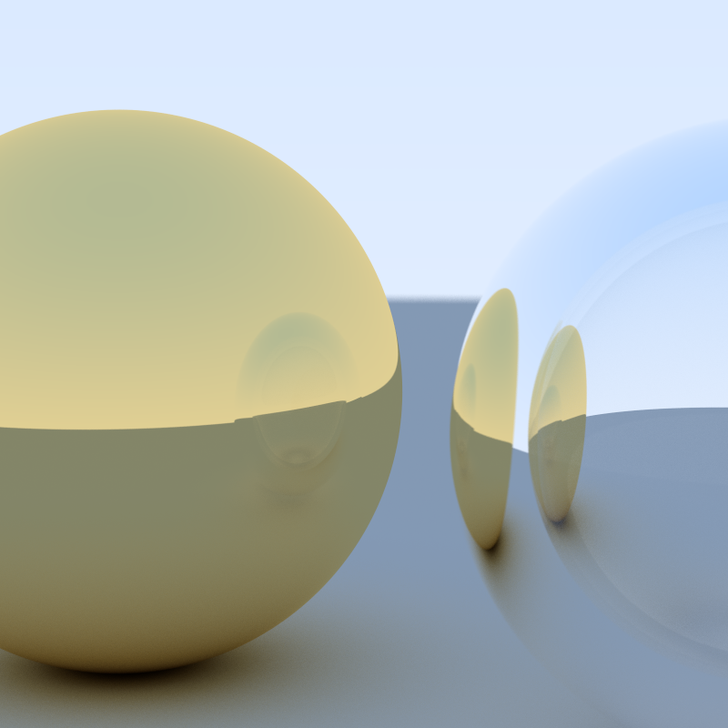

# Ray Tracer In a Weekend

  
   
  <em>A Hero Render</em>

SPHERES, SPHERES ANDDDDDDD SPHERES...

I spent a weekend, technically 1-2 hours each day spread out over course of a month ~ and guess what I did the entire time. Yea, I was ***shooting rayss***. More Technically, I build a Ray Tracer and more specifically it's a ***PathTracer*** with features like:

- Geomtry: Sphere ( just one for now )
- Materials
- Anti-Aliasing
- Depth of Field A.K.A Defocus Blur
- Positionable Camera
- Renderable Image with Custom Dimensions

Andd when I said, I was shooting rays ~ I meant it. To give a gist: We shoot a lot of rays, like ***50 billion lot***. Ideally, in best case scenario we would shoot roughly over ***1 billion rays*** and in worst case scenario we would shoot roughly over 50 billion rays ( depending upon properties of the ray tracer, scene, and Randomnesss )

The code in this repository is highly customized, written more of in a way that I want. I tried my best to keep it structured, and potentially expandable. I have implemented it in C++, used gcc compiler for generating an exe file. There also is a python script that I utilized to upscale lower resolution Images for showcasing anti-aliasing. With that said, following is a showcase of materials and different features

## Material Showcase

### Basic Materials

This section demonstrates different materials that exist, and how they interact with light ( with respect to physics ). Each Material implemented, takes care of two things: ***attenuation*** and ***scattering***. And depending upon just two factors we have created a bunch of materials ( kind of nuanced explanation ). A quick glance at list of materials that are present in the code base:
- Normal
- Diffuse 
- Solid
- Metal
- Dielectric

<table>
  <tbody>
    <tr>
      <td >
        
        

          Solid - Flat-colored material,
        

      </td>
      <td>
        
        

          Diffuse - A Lambertian surface that scatters light evenly in all directions.
        

      </td>
      <td>
        
        

          Normal - Visualizes the normal vectors
        

      </td>
    </tr>
  </tbody>
</table>

### Metal

Metal, as a material consists of two major properties: ***reflectance*** and ***color*** of the metal itself. The reflectance can also have a "***fuzz***" factor, just like in real life. Below you can see a progression of fuzz factor from shiny metal ball to almost diffuse metal ball ( acts just like a diffuse spehre material )

<table>
  <tbody>
    <tr>
      <td >
        
        

          Metal - 0 fuzz
        

      </td>
      <td>
        
        

          Metal 0.5 fuzz
        

      </td>
      <td>
        
        

          Metal 1 fuzz
        

      </td>
    </tr>
  </tbody>
</table>

Just to showcase the "magic" of PathTracing, I have also created the following two scenarios:
- ***metal + metal reflections***: You can see the infinite reflection pattern on both the spheres ( just like real life )
- ***metal + dielectric reflections***: You can see the faint reflections of a glass sphere and also the glass sphere reflecting + refracting the metal sphere

<table>
  <tbody>
    <tr>
      <td >
        
        

          Dielectric Reflecting Into Metal
        

      </td>
      <td>
        
        

          Metal Reflecting Into Metal
        

      </td>
    </tr>
  </tbody>
</table>

###  Dielectric

***Dielectrics*** are materials that are weak conductors of electricty, like wool, water, sand, air etc.. Here we tried to simulate "***glass***" and that too with reflection, refraction and total internal reflection. You might feel that the glass balls are floating due to abscence of shadow but even in real life glass balls rarely have a dense shadow. If you focus at the bottom center of the sphere, you might see a faint patch of shadow

<table>
  <tbody>
    <tr>
      <td >
        
        

          Dielectric - RI: ( 1.00 / 1.33 )
        

      </td>
      <td>
        
        

          Dielectric Inside Dielectric - RI1 ( outer ): ( 1.50 ) + RI2 ( inner ): ( 1.00 / 1.50 )
        

      </td>
    </tr>
  </tbody>
</table>

### Anti-Aliasing

Anti-Aliasing helps reduce the jagged, stair-step edges that can appear in digital images, especially along diagonal lines or curves. In the real world, visual information is continuous, but in a rendered image, we approximate it with a grid of discrete pixels. By taking multiple samples per pixel and averaging the results, anti-aliasing creates smoother transitions and more realistic gradients, resulting in a cleaner and more natural-looking image.

<table>
  <tbody>
    <tr>
      <td >
        
        

          SPP 1
        

      </td>
      <td>
        
        

          SPP 100
        

      </td>
      <td>
        
        

          SPP 500
        

      </td>
    </tr>
  </tbody>
</table>

### Depth of Field 

You already must have had experience with depth of Field, when you click photos or even watch vlogs on youtube. You might see that the speaker is sharp but the background is blurred, that is due to depth of field

The "Field" in "Depth of Field" is merely an area in which objects appear sharp, the "Depth" in "Depth of Field" is like "how deep is the field", and mostly we are interested in controlling this so called "Depth". Unfortunately for us, according to our current implementation ( based on book ), we wouldn't be able to control the "deepness" of the field, rather for us ~ it's a "field" where object will appear in focus but more like a "Plane" and what ever is in the plane region will appear sharp. Things further before or after the plane will get blurred.

Two things can control Depth of Field:
- De-focus Angle: If there is a blur section in an image, then how much to blur it
- De-focus Distance: When to place the plane, at this distance everything will be sharp

#### De-focus Angle "How much to blur the blurry regions"

<table>
  <tbody>
    <tr>
      <td >
        
        

          Defocus Angle 1.0
        

      </td>
      <td>
        
        

          Defocus Angle 0.5
        

      </td>
      <td>
        
        

          Defocus Angle 1.0
        

      </td>
    </tr>
  </tbody>
</table>

#### De-focus Distance "What region should appear sharp"

<table>
  <tbody>
    <tr>
      <td >
        
        

          Defocus Distance
        

      </td>
      <td>
        
        

          Defocus Distance
        

      </td>
    </tr>
  </tbody>
</table>

### FOV

Field of View controls how wide the camera can see. A smaller FOV gives a zoomed-in, narrow perspective, while a larger FOV creates a wide-angle view. We use vFOV here, but also hFOV would have been fine. In our case we supply the vFOV and the dimensions are automatically adjusted

<table>
  <tbody>
    <tr>
      <td >
        
        

          FOV 20
        

      </td>
      <td>
        
        

          FOV 90
        

      </td>
    </tr>
  </tbody>
</table>

### Max Depth & SPP

In ray tracing, max depth defines the maximum number of times a ray is allowed to bounce (or recurse) before it's terminated. Each bounce represents a light interaction — such as reflection, refraction, or scattering.

In Ray Tracing in One Weekend, this is used to avoid infinite recursion and control render time. A ray that exceeds the max depth is assumed to contribute no more light, and its color is set to black

- A lower max depth results in faster renders but may miss deeper reflections or refractions.
- A higher max depth produces more realistic images, especially for transparent or reflective materials, but is computationally more expensive.

<table>
  <tbody>
    <tr>
      <td >
        
        

          Max Depth 2 SPP 500
        

      </td>
      <td>
        
        

          Max Depth 10 SPP 500
        

      </td>
      <td>
        
        

          Max Depth 50 SPP 500
        

      </td>
    </tr>
  </tbody>
</table>

SPP controls how many rays are shot per pixel to estimate its final color. Instead of casting just one ray, multiple rays with slight random offsets are averaged to reduce noise and achieve anti-aliasing. 
Fun Fact: Since SPP adds extra rays, the extra rays tend to be additional cost. DOF uses this additional cost to it's benefit and implements the blur effect

<table>
  <tbody>
    <tr>
      <td >
        
        

          Max Depth 50 SPP 2
        

      </td>
      <td>
        
        

          Max Depth 50 SPP 50
        

      </td>
      <td>
        
        

          Max Depth 50 SPP 500
        

      </td>
    </tr>
  </tbody>
</table>

### Low Depth + Low SPP and Bounced Reflections

You can see that low Depth + low SPP, would result into a grainy and dark image because not enough rays are spawned which results in bad sampling and low Depth causes less infoinformation to be gathered. In the right image, you can see that a image generated with good parameters would give a good anti-aliased + tinted reflections + smooth image

<table>
  <tbody>
    <tr>
      <td >
        
        

          Max Depth 2 SPP 2
        

      </td>
      <td>
        
        

          Bounced Reflections
        

      </td>
    </tr>
  </tbody>
</table>

