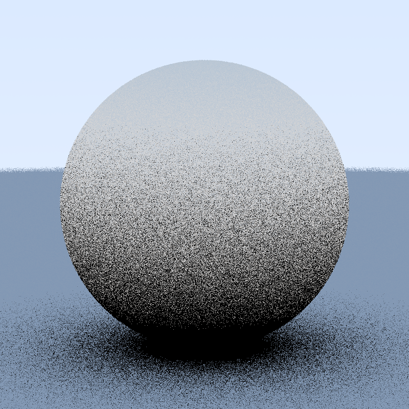

# Ray Tracer In a Weekend

## Material ShowCase

| Solid | Diffuse | Normal |
|-------|---------|--------|
|  |  |  |

| Metal ( 0 fuzz ) | Metal ( 0.5 fuzz ) | Metal ( 1 fuzz ) |
|-------|---------|--------|
|  |  |  |

<table>
    <thead>
    <tr>
      <th width="50%">Column 1 Title</th>
      <th width="50%">Column 2 Title</th>
    </tr>
  </thead>
  <tbody>
  <tr>
    <td width="50%">
      dsdfsdf
    </td>
    <td width="50%">
      
    </td>
  </tr>
    </tbody>
</table>

| Dielectric | Dielectric inside Dielectric |
|-------|---------|
|  |  |

<table>
    <thead>
    <tr>
      <th width="50%">Column 1 Title</th>
      <th width="50%">Column 2 Title</th>
    </tr>
  </thead>
  <tbody>
  <tr>
    <td width="50%">
      dsdfsdf
    </td>
    <td width="50%">
      
    </td>
  </tr>
    </tbody>
</table>

| SPP 1 | SPP 100 | SPP 500 |
|-------|---------|--------|
|  |  |  |

| defocus Angle 0.0 | defocus Angle 0.5 | defocus Angle 1.0 |
|-------|---------|--------|
|  |  |  |

| defocus Distance | defocus Distance |
|-------|---------|
|  |  |

| fov 20 | fov 90 |
|-------|---------|
|  |  |

| max Depth 2 SPP 500 | max Depth 10 SPP 500|
|---------|--------|
|  |  |

| max Depth 50 SPP 2 | max Depth 50 SPP 50 | 
|--------------------|---------------------|
|  |  | 

| max Depth 2 SPP 2 | max Depth 50 SPP 500 |
|-------------------|----------------------|
|  |  |
